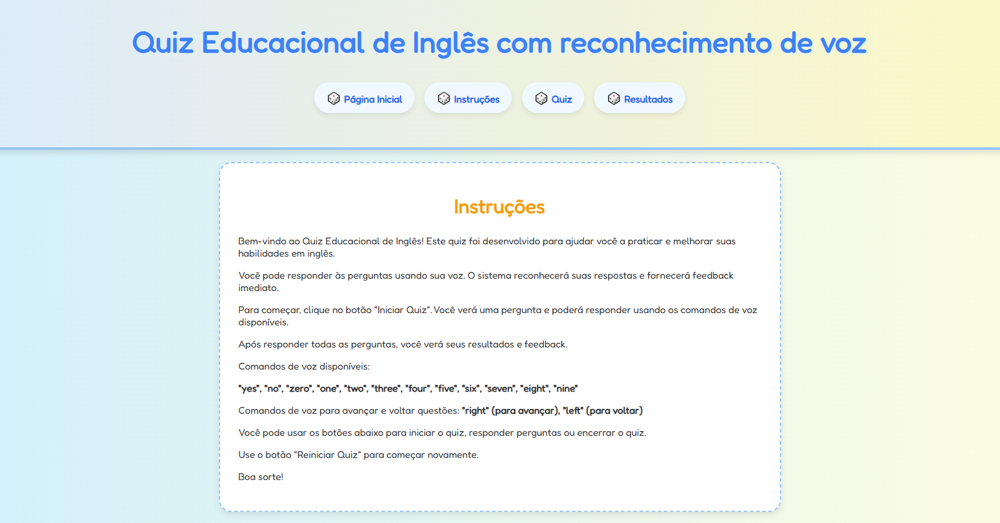
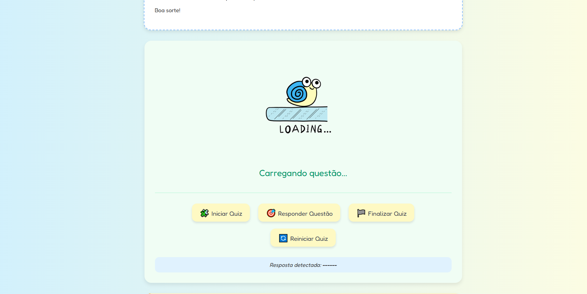
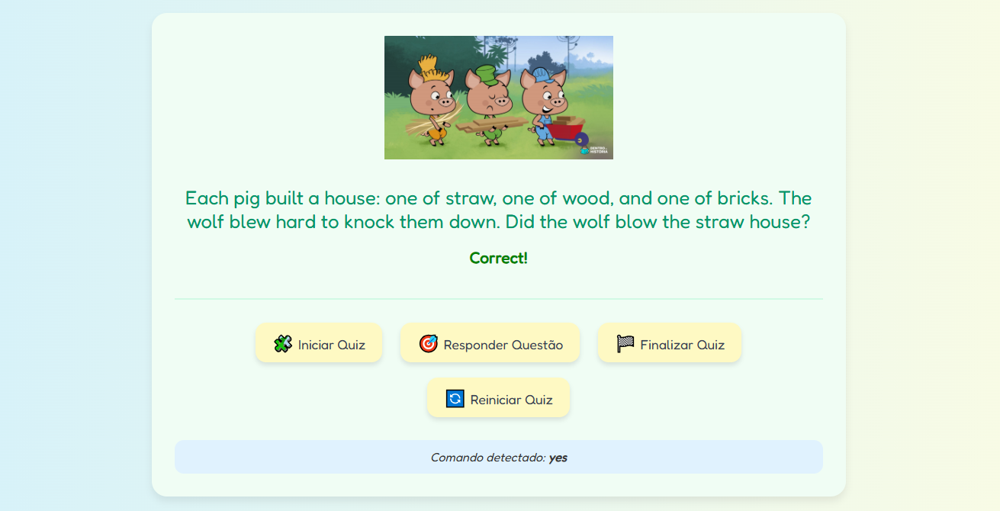
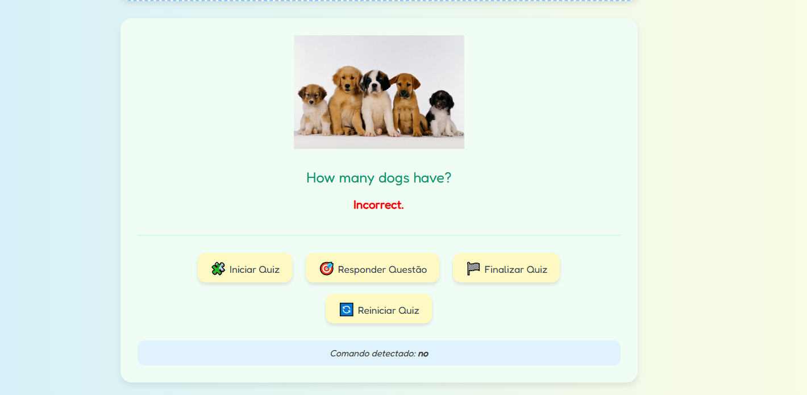
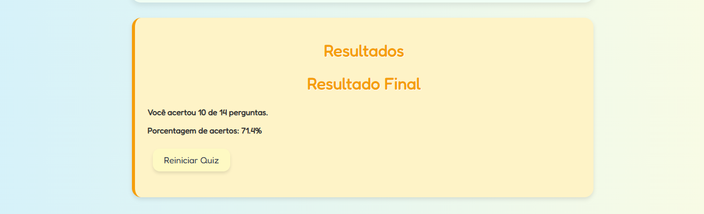

# Aplicação Web Educacional com IA: Quiz Interativo com Reconhecimento de Voz

## Introdução e Objetivos

Esta aplicação web tem como objetivo oferecer uma experiência de aprendizado interativa e moderna para alunos por meio de um **quiz educacional** com **reconhecimento de voz**. O sistema utiliza **Inteligência Artificial com TensorFlow.js** para captar comandos de voz do usuário e processar as respostas, tornando o processo de aprendizagem mais dinâmico e inclusivo.

---

## Descrição Técnica da Implementação

### Estrutura da Aplicação

- `index.html` (nome real: `ia_somtunado.html`): estrutura da interface.
- `styles.css`: estilização visual e responsividade.
- `app.js`: lógica da aplicação, controle do quiz, e integração com o modelo IA.

### Funcionalidades

- Interface de quiz com perguntas de múltipla escolha.
- Detecção de palavras por voz utilizando modelo `speech-commands` do TensorFlow.js.
- Feedback automático com base nas respostas.
- Sistema de pontuação.
- Interface interativa com botões e emojis para atrair o usuario final(crianças do fundamental).

---

## Tecnologias Utilizadas

- **HTML5**: Estrutura da página.
- **CSS3**: Design visual, responsividade e UX.
- **JavaScript**: Lógica da aplicação.
- **[TensorFlow.js](https://www.tensorflow.org/js)**: biblioteca para execução de modelos IA no navegador.
- **Modelo Utilizado:** [`speech-commands`](https://github.com/tensorflow/tfjs-models/tree/master/speech-commands)

---

## Instruções de Execução Local

1. Baixe todos os arquivos do projeto:
   - `ia_somtunado.html`
   - `app.js`
   - `styles.css`
   - `img\*`(conteúdo de imagens gifs do projeto)

2. Coloque todos os arquivos na mesma pasta.

3. Para executar corretamente, é necessário rodar o projeto em um servidor local (localhost). Você pode utilizar extensões como Live Server no VS Code ou rodar com o comando python -m http.server (Python 3) no terminal dentro da pasta do projeto(Necessário devido as imagens que estão no JS).

4. Após iniciar o servidor local, abra o navegador e acesse o endereço fornecido (exemplo: http://localhost:5500/ia_somtunado.html).

5. Clique em “Iniciar Quiz” e permita o acesso ao microfone.

---

## Print Screens da Aplicação
### Tela Inicial do Quiz
- Exibe a tela de boas-vindas com opção para iniciar o quiz.
- Interface simples e intuitiva.

### Tela de Standby 
- A aplicação aguarda o comando de voz do usuário.
- Interface com opções visíveis para facilitar a navegação por voz.

### Tela do Quiz — Aguardando Comando de Voz
- Exibição de resposta correta com feedback positivo.
- Reflete a interação bem-sucedida entre usuário e sistema.

### Tela do Quiz — Resposta Correta
- Exibição de resposta errada com destaque visual.
- Ajuda a reforçar o aprendizado ao indicar a resposta certa.

### Tela do Quiz — Resultado do Quiz
- Mostra a pontuação final obtida no quiz.
- Motiva o usuário com um resumo de desempenho.

---
### Link para Vídeo Explicativo
- [VideoLixo.mp4](https://youtu.be/6Ux5-oC99Cw)
---
## Referências e Links de Apoio

- [TensorFlow.js - speech-commands](https://github.com/tensorflow/tfjs-models/tree/master/speech-commands)
- [Documentação oficial do TensorFlow.js](https://www.tensorflow.org/js)
- [MDN Web Docs - HTML, CSS, JavaScript](https://developer.mozilla.org/) "nada como aprender do cliente (heheh)"

---
## Autor

- Nome: Alexandre Aparecido da Silva

Disciplina: Desenvolvimento de Aplicações Web  
Professor: Luiz v2

---

