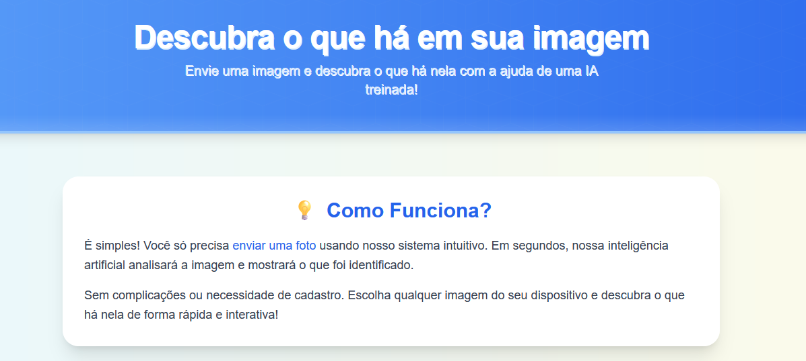
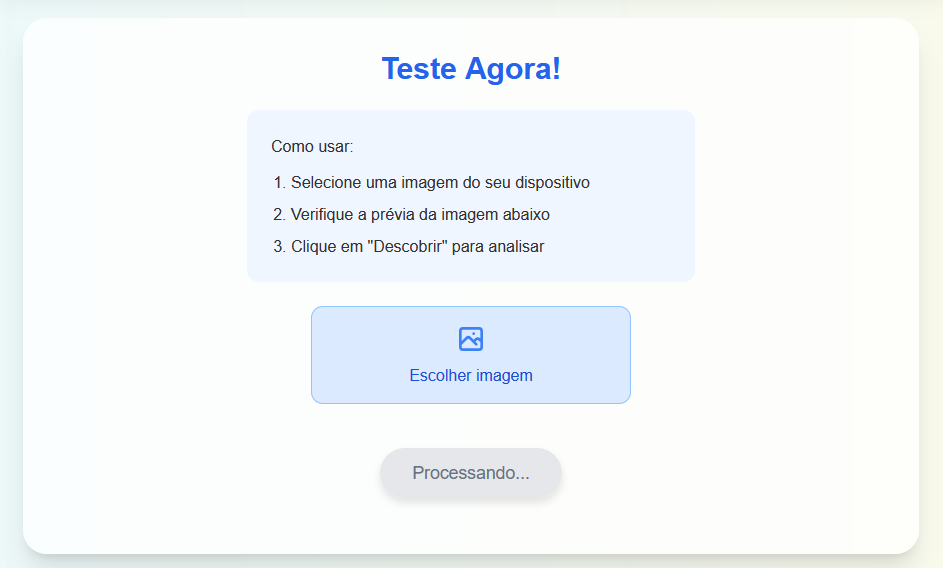
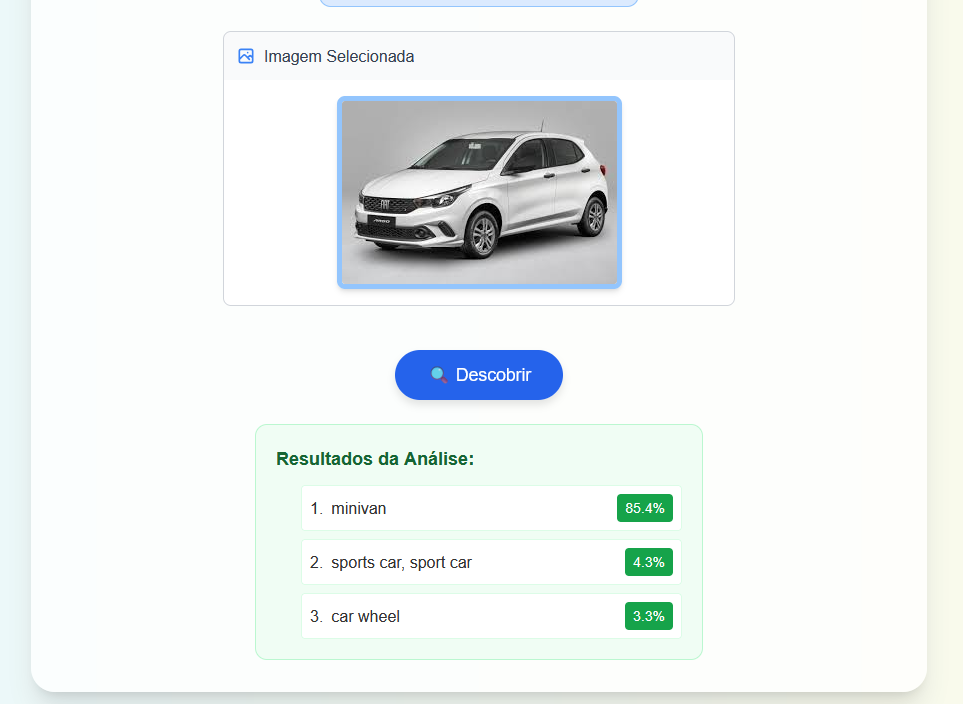
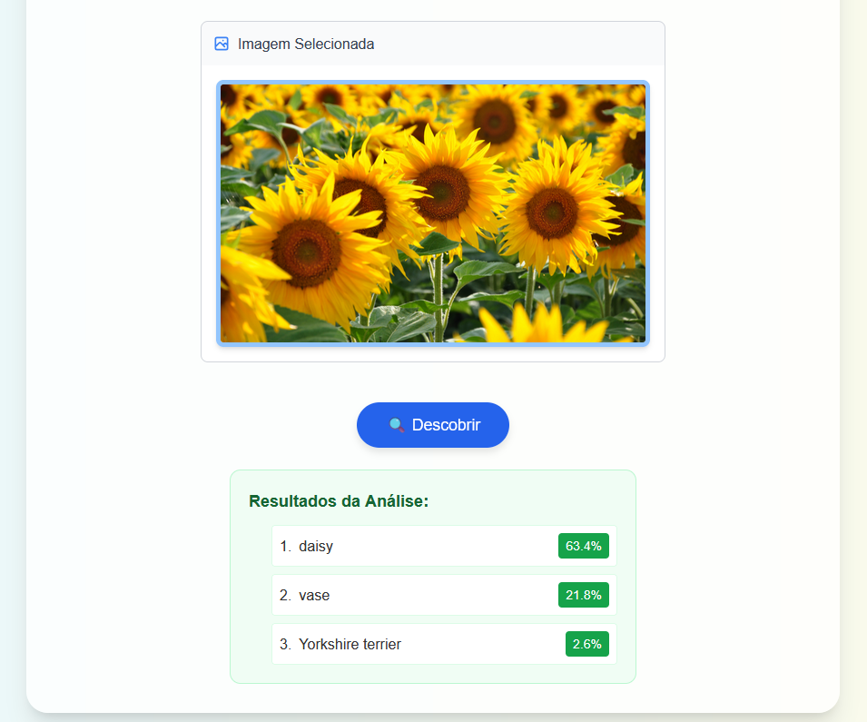
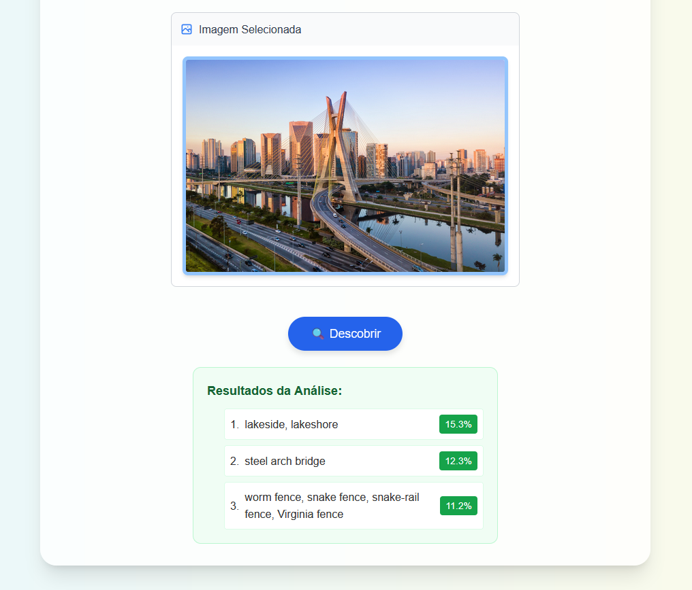
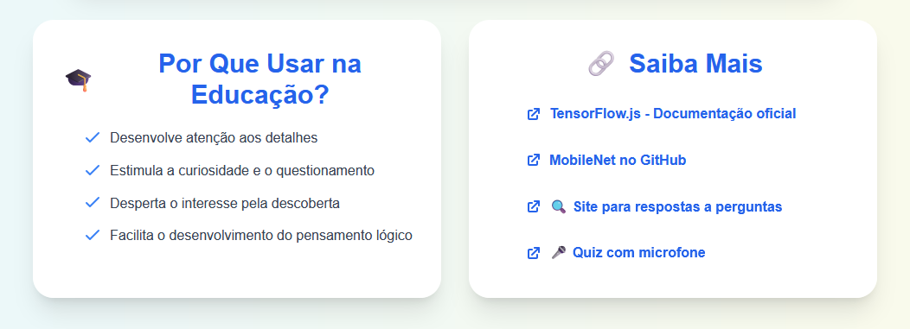

# Descubra o que há em sua imagem

Esta aplicação web permite que o usuário **envie uma imagem** e receba uma **análise visual feita por Inteligência Artificial**, utilizando o modelo pré-treinado **ResNet50** com **PyTorch** no backend. É uma ferramenta educacional interativa e acessível que incentiva o aprendizado por meio da curiosidade visual.

---

## Objetivo

Facilitar o ensino de conceitos visuais, biológicos e tecnológicos através de uma experiência prática com visão computacional. A aplicação foi desenvolvida para ser usada tanto em ambientes escolares quanto em casa, proporcionando uma introdução acessível à IA para estudantes de diferentes idades.

---

## Funcionalidades

- Upload de imagens diretamente do dispositivo (computador ou celular)
- Classificação automática do conteúdo da imagem via backend
- Exibição de lista com os possíveis objetos identificados e sua respectiva probabilidade
- Interface amigável, responsiva e com foco em acessibilidade infantil
- Visual moderno com botões intuitivos e destaque em cores educativas
- Fundo em degradê suave que proporciona melhor experiência visual
- Interface interativa com feedback visual do processo de análise

---

## Tecnologias Utilizadas

### Frontend
- **React.js** — biblioteca para criação de interfaces de usuário interativas
- **TailwindCSS** — framework CSS utilitário para estilização moderna
- **JavaScript (ES6+)** — lógica e integração com o backend

### Backend
- **FastAPI** — framework Python para criação de APIs rápidas
- **PyTorch** — biblioteca de deep learning para processamento de imagens
- **[ResNet50](https://pytorch.org/vision/stable/models.html)** — modelo de rede neural para classificação de imagens
- **ImageNet** — base de dados usada para treinamento do modelo ResNet50

### Sobre o ResNet50 e ImageNet

O **ResNet50** é uma arquitetura de rede neural profunda com 50 camadas que revolucionou a área de reconhecimento de imagens:

- **Conexões residuais** — permitem treinar redes muito mais profundas com maior eficiência
- **Alta precisão** — treinado no dataset ImageNet com mais de 1 milhão de imagens
- **Pré-treinado** — reconhece mais de 1000 classes de objetos diferentes
- **Robusto** — performance estado-da-arte em várias tarefas de visão computacional

**ImageNet** é um banco de dados visual projetado para uso em pesquisa de reconhecimento visual de objetos:
- Contém mais de 14 milhões de imagens anotadas
- Organizado de acordo com a hierarquia WordNet
- Padrão da indústria para treinar e avaliar modelos de classificação de imagens

---

## Descrição Técnica da Implementação

A aplicação utiliza uma arquitetura cliente-servidor:

1. **Frontend (React)**:
   - Interface de usuário responsiva e intuitiva
   - Upload de imagens e exibição de resultados
   - Comunicação com backend via API REST

2. **Backend (FastAPI/PyTorch)**:
   - API REST implementada com FastAPI
   - Processamento de imagens com PyTorch e ResNet50
   - Classificação baseada no dataset ImageNet
   - Retorno de resultados formatados para o frontend

3. **Processamento de Imagem**:
   - A imagem enviada é convertida para formato adequado para o modelo
   - O modelo ResNet50 processa a imagem no servidor
   - Os resultados são enviados de volta ao frontend

4. **Gestão de Estados**:
   - Estados React são usados para controlar o fluxo da aplicação
   - Feedback visual é fornecido em cada etapa (carregando, analisando, resultados)

5. **Otimizações**:
   - Código totalmente comentado para facilitar manutenção
   - Tratamento de erros tanto no frontend quanto no backend
   - Servidor configurado com CORS para comunicação segura

---

## Como Funciona

1. O usuário **escolhe uma imagem** do dispositivo
2. A imagem é **enviada para o backend** através de uma requisição HTTP
3. O backend **processa e classifica** a imagem usando ResNet50 e ImageNet
4. Os **resultados são exibidos** na tela com uma lista de objetos reconhecidos e suas probabilidades

---

## Instruções Detalhadas de Execução

### Pré-requisitos

- **Node.js** (versão 14.x ou superior) para o frontend
- **Python 3.8+** para o backend
- **npm** (6.x ou superior) ou **yarn** (1.22.x ou superior)
- Navegador moderno (Chrome, Firefox, Edge ou Safari)

### Método 1: Configuração do Backend

1. **Prepare o ambiente**:
   ```bash
   # Entre na pasta do backend
   cd backend
   
   # Crie um ambiente virtual Python
   python -m venv venv
   
   # Ative o ambiente virtual
   # Windows:
   venv\Scripts\activate
   # Linux/Mac:
   source venv/bin/activate
   
   # Instale as dependências
   pip install -r requirements.txt
   ```

2. **Estrutura do backend**:
   ```
   /backend
   ├── /app
   │   ├── /ai_service     # Tratamento da ia
   │   ├── /main           # Implementaçao geral
   ├── requirements.txt    # Necessidades do backend
   └── .env                # Variáveis de ambiente
   ```

3. **Execute o backend**:
   ```bash
   # Inicie o servidor
   uvicorn app.main:app --reload
   ```

### Método 2: Configuração do Frontend

1. **Clone e configure**:
   ```bash
   # Clone o repositório
   git clone [URL-DO-REPOSITÓRIO]
   
   # Entre na pasta do projeto
   cd [NOME-DA-PASTA]
   
   # Instale as dependências
   npm install
   # ou
   yarn install
   ```

2. **Estrutura do projeto React**:
   ```
   /projeto
   ├── /public              # Arquivos estáticos públicos
   ├── /src                 # Código-fonte
   │   ├── /components      # Componentes React
   │   │   └── ImageUploader.js  # Componente principal
   │   │   └── ResultDisplay.js  # Componente principal
   │   │   └── Footer.js         # Componente de rodapé
   │   │   └── Header.js         # Componente de cabeçalho
   │   │   └── InfoSection.js    # Componente de informações
   │   ├── /services      # Serviços de IA
   │   │   └── api.js  # Lógica de chamada à API
   │   ├── index.js         # Ponto de entrada
   │   └── styles.css       # Estilos globais
   ├── package.json         # Dependências do projeto
   ├── tailwind.config.js   # Configuração do TailwindCSS
   ├── postcss.config.js    # Configuração do PostCSS
   └── README.md            # Documentação
   ```

3. **Execute o projeto**:
   ```bash
   # Inicie o servidor de desenvolvimento
   npm start
   # ou
   yarn start
   ```

4. **Acesse a aplicação**:
   - Abra o navegador em: `http://localhost:3000`
   - A aplicação será recarregada automaticamente se você editar os arquivos fonte

5. **Uso da aplicação**:
   - O modelo ResNet50 será carregado automaticamente ao iniciar
   - Use o botão de upload para selecionar uma imagem do seu dispositivo
   - Clique em "Descobrir" para processar a análise
   - Visualize os resultados com as previsões e probabilidades
   - Para analisar outra imagem, faça um novo upload

6. **Build para produção** (opcional):
   ```bash
   npm run build
   # ou
   yarn build
   ```
   - Os arquivos otimizados serão gerados na pasta `/build`
   - Você pode servir estes arquivos em qualquer servidor web estático

### Método 3: Execução Completa (Frontend + Backend)

Para casos que necessitam armazenamento de dados ou processamento no servidor:

1. **Configure o Backend**:
   - Siga as instruções da Configuração do Backend acima

2. **Configure o Frontend**:
   - Siga as instruções da Configuração do Frontend acima

3. **Para desenvolvimento integrado**:
   - Frontend: `http://localhost:3000`
   - Backend API: `http://localhost:8000/api`
   - As requisições do frontend para o backend são redirecionadas pelo proxy configurado no `package.json`


### Solução de Problemas Comuns

1. **Modelo não carrega**:
   - Verifique sua conexão com internet
   - Limpe o cache do navegador
   - Tente outro navegador moderno

2. **Imagem não é analisada**:
   - Verifique se a imagem foi carregada corretamente (deve aparecer na prévia)
   - Certifique-se que o formato é suportado (JPG, PNG)
   - Tente uma imagem menor (menos de 5MB)

3. **Erro de CORS**:
   - Se estiver executando localmente, use um servidor local em vez de abrir diretamente o arquivo HTML
   - Para React, verifique se o proxy está configurado corretamente

4. **Dependências não instalam**:
   - Limpe o cache do npm: `npm cache clean --force`
   - Verifique sua versão do Node.js: `node -v`
   - Tente usar o Yarn como alternativa

---

## Print Screens da Aplicação

A seguir estão algumas telas da aplicação "Descubra o que há em sua imagem":

### 1. Tela Inicial
Exibe o título da aplicação e a descrição principal com cores chamativas e layout amigável para crianças e professores.
Explica ao usuário, de forma simples, como usar a ferramenta: enviar uma imagem e visualizar os resultados com IA.



---

### 2. Upload e Botão de Análise
Interface com o botão de upload e o botão de análise ("🔍 Descobrir"). O modelo ResNet50 é carregado em segundo plano.


Exemplo de resultados juntamente com as análises.

🚗 **Carro**:


🌱 **Planta**:


🏙️ **Cidade**:


---

### 3. Aplicação no Contexto Educacional
Demonstra como a ferramenta pode ser aplicada em sala de aula, reforçando a atenção, observação e raciocínio lógico dos estudantes.



---

## Aplicações Educacionais

Esta ferramenta pode ser usada em:

- **Aulas de ciências e biologia**: identificação de animais, plantas, objetos
- **Educação infantil e fundamental**: incentivo à curiosidade e observação
- **Introdução à inteligência artificial**: mostrar de forma prática como um modelo pré-treinado pode ser usado
- **Projetos interdisciplinares**: combinando tecnologia com ciências, artes e línguas

---

## Detalhes Técnicos do Código

O componente principal `ImageUploader` implementa as seguintes funcionalidades:

```javascript
// Carregamento do modelo ResNet50
useEffect(() => {
  async function loadModel() {
    const response = await fetch('http://localhost:8000/api/load_model');
    const data = await response.json();
    setModel(data.model);
    setLoading(false);
  }
  loadModel();
}, []);

// Envio da imagem para o backend
const handleClassify = async () => {
  if (image) {
    setPredictions([]);
    setLoading(true);
    
    try {
      // Converter base64 para blob
      const base64Response = await fetch(image);
      const blob = await base64Response.blob();
      
      // Criar FormData para enviar a imagem
      const formData = new FormData();
      formData.append('file', blob, 'image.jpg');
      
      // Fazer a requisição para o backend
      const response = await fetch('http://127.0.0.1:8000/api/classify', {
        method: 'POST',
        body: formData,
      });
      
      if (response.ok) {
        const data = await response.json();
        setPredictions(data.predictions);
      } else {
        console.error('Erro na classificação');
      }
    } catch (error) {
      console.error("Erro ao classificar imagem:", error);
    } finally {
      setLoading(false);
    }
  }
};
```

Backend - Processamento com ResNet50:

```python
# Classificação da imagem usando PyTorch e ResNet50
def classify_image(image):
    # Preparar a imagem para o modelo
    input_tensor = preprocess(image)
    
    # Realizar a inferência
    with torch.no_grad():
        output = model(input_tensor)
    
    # Processar as probabilidades com softmax
    probabilities = torch.nn.functional.softmax(output[0], dim=0)
    
    # Obter as 5 classes mais prováveis
    top5_prob, top5_catid = torch.topk(probabilities, 5)
    
    # Formatar os resultados
    results = []
    for i in range(top5_prob.size(0)):
        results.append({
            "className": categories[top5_catid[i]],
            "probability": top5_prob[i].item()
        })
    
    return results
```

O código completo está amplamente comentado para facilitar o entendimento e manutenção.

---

## Vídeo

Vídeo demonstrativo1: [Vídeo Explicativo](https://youtu.be/T6Q3TJRtWpc)

Vídeo demonstrativo2: [Vídeo Explicativo](https://youtu.be/GjGauqGPA5Y)

Este vídeo de 30 segundos demonstra o funcionamento da aplicação, desde o upload da imagem até a exibição dos resultados da classificação.

---

## Fontes e Referências

- [TensorFlow.js - MobileNet](https://github.com/tensorflow/tfjs-models/tree/master/mobilenet) - Documentação do modelo utilizado
- [Documentação oficial do TensorFlow.js](https://www.tensorflow.org/js) - Framework de IA para JavaScript
- [React Documentation](https://react.dev/) - Framework para construção da interface
- [TailwindCSS Documentation](https://tailwindcss.com/docs) - Framework CSS utilizado
- [MDN Web Docs](https://developer.mozilla.org/) - Referência para JavaScript e Web APIs
- [Google Fonts - Fredoka, Inter](https://fonts.google.com/) - Fontes utilizadas no projeto
- [Understanding MobileNet Architecture](https://medium.com/@yu4u/why-mobilenet-and-its-variants-e-g-shufflenet-are-fast-1c7048b9618d) - Artigo explicativo sobre a arquitetura MobileNet

---

## Autor 

**Arthur Henrique de Oliveira Petroli**  
📧 arthurpetroli@alunos.utfpr.edu.br  
🧑‍🎓 Projeto desenvolvido para fins educacionais — UTFPR - Engenharia da Computação  
📅 Maio de 2025

---

## Licença

Este projeto é de uso livre para fins educacionais e acadêmicos.

---