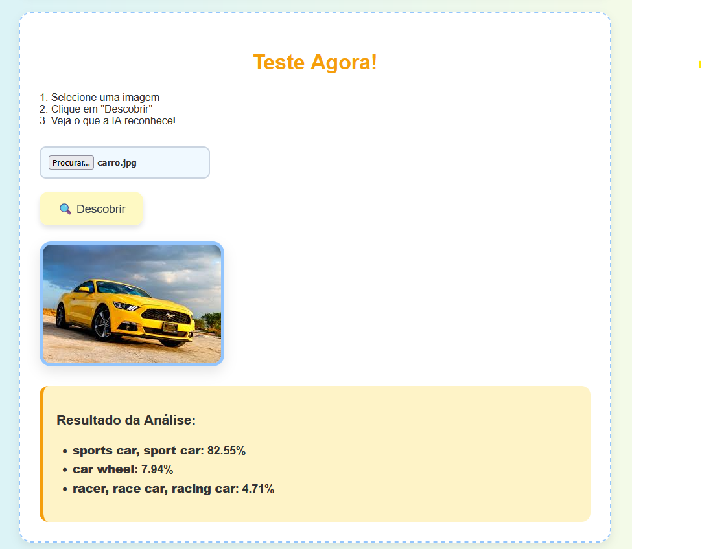
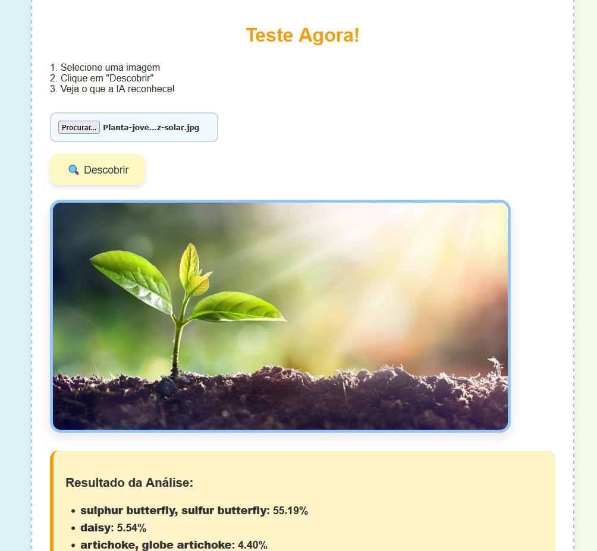
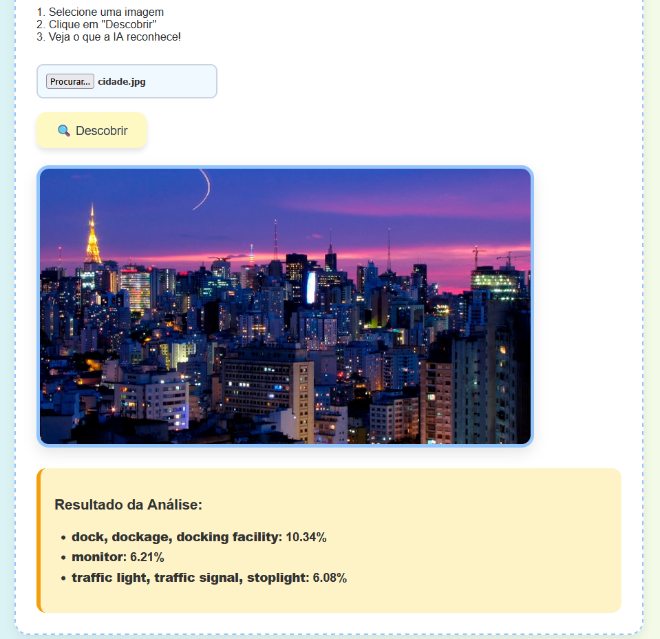
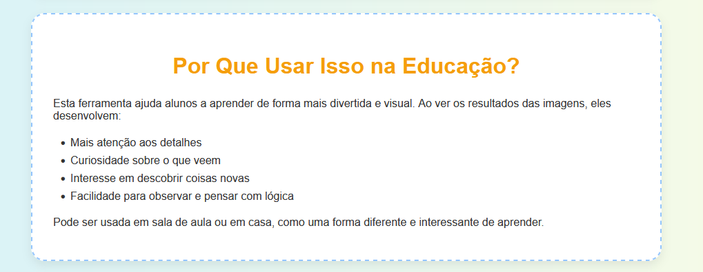

# Descubra o que há em sua imagem

Esta aplicação web permite que o usuário **envie uma imagem** e receba uma **análise visual feita por Inteligência Artificial**, utilizando o modelo pré-treinado **MobileNet** com **TensorFlow.js**. É uma ferramenta educacional interativa e acessível que incentiva o aprendizado por meio da curiosidade visual.

---

## Objetivo

Facilitar o ensino de conceitos visuais, biológicos e tecnológicos através de uma experiência prática com visão computacional. A aplicação foi desenvolvida para ser usada tanto em ambientes escolares quanto em casa.

---

## Funcionalidades

- Upload de imagens diretamente do dispositivo (computador ou celular).
- Classificação automática do conteúdo da imagem.
- Exibição de lista com os possíveis objetos identificados e sua respectiva probabilidade.
- Interface amigável, responsiva e com foco em acessibilidade infantil.
- Visual moderno com botões intuitivos e destaque em cores educativas.

---

## Tecnologias Utilizadas

- **HTML5 & CSS3** — estrutura e estilo da aplicação.
- **JavaScript** — lógica e integração com o modelo de IA.
- **[TensorFlow.js](https://www.tensorflow.org/js)** — biblioteca de IA para uso no navegador.
- **[MobileNet](https://github.com/tensorflow/tfjs-models/tree/master/mobilenet)** — modelo leve de reconhecimento de imagem pré-treinado.

---

## Como Funciona

1. O usuário **escolhe uma imagem** do dispositivo.
2. A IA **processa e classifica** a imagem com base em sua base de dados de reconhecimento.
3. Os **resultados são exibidos** na tela com uma lista de objetos reconhecidos e suas probabilidades.

---

## Como Usar Localmente

1. Baixe ou clone os arquivos do projeto.
2. Certifique-se de manter todos os arquivos em uma mesma pasta.
3. Abra o arquivo `index.html` (ou `PagePetroli.html`, conforme nome real) em um navegador moderno.
4. Espere a mensagem **"🔍 Descobrir"** aparecer (a IA está carregando).
5. Envie uma imagem e veja os resultados!

---

## Print Screens da Aplicação

A seguir estão algumas telas da aplicação "Descubra o que há em sua imagem", com breves descrições sobre sua funcionalidade:

### 1. Tela Inicial
Exibe o título da aplicação e a descrição principal com cores chamativas e layout amigável para crianças e professores.
Explica ao usuário, de forma simples, como usar a ferramenta: enviar uma imagem e visualizar os resultados com IA.

---

### 2. Upload e Botão de Análise
Interface com o botão de upload e o botão de análise ("🔍 Descobrir"). O modelo MobileNet é carregado em segundo plano.

Exemplo de resultados juntamente com as análises.

🚗 **Carro**:

🌱 **Planta**:

🏙️ **Cidade**:

---

### 3. Aplicação no Contexto Educacional
Demonstra como a ferramenta pode ser aplicada em sala de aula, reforçando a atenção, observação e raciocínio lógico dos estudantes.

---

## Aplicações Educacionais

Esta ferramenta pode ser usada em:

- **Aulas de ciências e biologia**: identificação de animais, plantas, objetos.
- **Educação infantil e fundamental**: incentivo à curiosidade e observação.
- **Introdução à inteligência artificial**: mostrar de forma prática como um modelo pré-treinado pode ser usado.

---

## Vídeo

Vídeo: [Vídeo Explicativo](https://youtu.be/T6Q3TJRtWpc)

---

## Fontes e Referências

- [TensorFlow.js - MobileNet](https://github.com/tensorflow/tfjs-models/tree/master/mobilenet)
- [Documentação oficial do TensorFlow.js](https://www.tensorflow.org/js)
- [MDN Web Docs](https://developer.mozilla.org/)

---

## Autor 

**Arthur Henrique de Oliveira Petroli**  
📧 arthurpetroli@alunos.utfpr.edu.br  
🧑‍🎓 Projeto desenvolvido para fins educacionais — UTFPR - Engenharia da Computação  
📅 Maio de 2025

---

## Licença

Este projeto é de uso livre para fins educacionais e acadêmicos.
