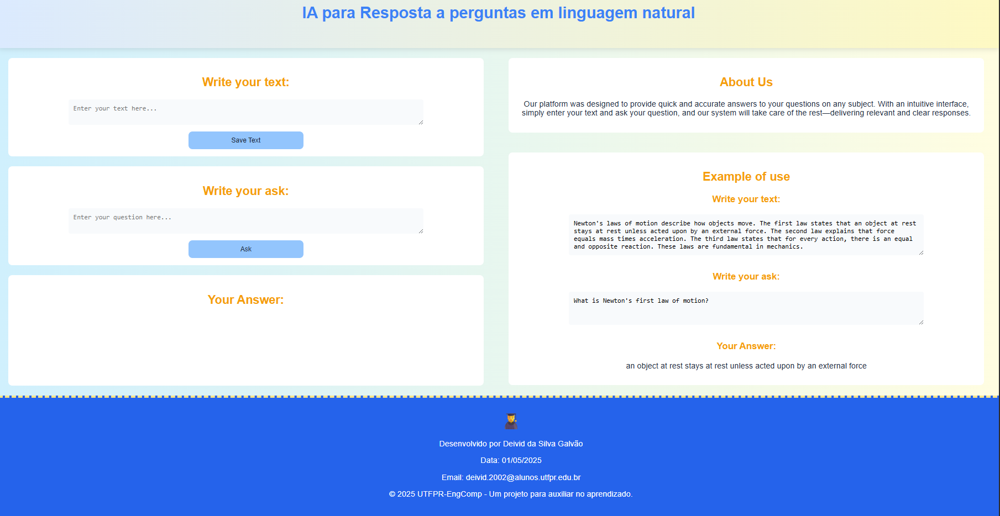
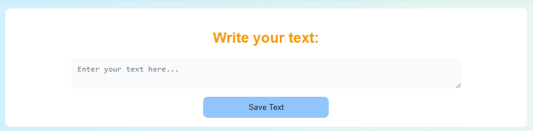
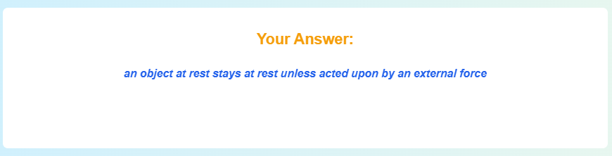

# Aplicação Web Educacional com IA: Resposta a perguntas em linguagem natural

## Introdução e Objetivos

Esta aplicação web tem como objetivo oferecer uma experiência de aprendizado interativa e moderna para alunos por meio de  **perguntas e respostas** com **uso de uma IA de texto**. O sistema utiliza **Inteligência Artificial com TensorFlow.js** para captar o texto do usuário e processar as respostas, tornando o processo de aprendizagem mais dinâmico e inclusivo.

---

## Descrição Técnica da Implementação

### Estrutura da Aplicação

- `PageTex.html`: estrutura da interface.
- `styles.css`: estilização visual e responsividade.
- Js integrado no HTML: lógica da aplicação e integração com o modelo IA.

### Funcionalidades

- Interface simples e intuitiva para digitar textos e perguntas.
- Utilização do modelo qna da biblioteca TensorFlow.js para compreensão de linguagem natural.
- Extração automática de respostas diretamente do conteúdo inserido pelo usuário.
- Área de demonstração com exemplo prático para facilitar o uso.
- Interface responsiva com layout dividido em seções claras (texto, pergunta, resposta).
- Estilo visual adaptado para facilitar a leitura e navegação por usuários de diferentes níveis.

---

## Tecnologias Utilizadas

- **HTML5**: Estrutura da página.
- **CSS3**: Design visual, responsividade e UX.
- **JavaScript**: Lógica da aplicação.
- **[TensorFlow.js](https://www.tensorflow.org/js)**: biblioteca para execução de modelos IA no navegador.
- **Modelo Utilizado:** [`qna`](https://github.com/tensorflow/tfjs-models/tree/master/qna)

---

## Instruções de Execução Local

1. Baixe todos os arquivos do projeto:
   - `PageTex.html`
   - `styles.css`

2. Coloque todos os arquivos na mesma pasta.

3. Para executar corretamente, é necessário rodar o projeto em um servidor local (localhost).

4. Após iniciar o servidor local, abra o navegador e acesse o endereço fornecido (exemplo: http://localhost:5500/PageTex.html).

---
## Instruções para Usar o Site
### Tela inicial do site:

1. Digitar um texto no campo "Write your text:".

2. Digitar uma pegunta em relação ao texto que foi colocado acima no campo "Write your ask:" .

3. A resposta aparecerá em baixo do "Your Answer:" após a análise.

### Link para Vídeo Explicativo
- [VideoLixo2.mp4](https://youtu.be/1vzVwyQHIQ4)
---
## Referências e Links de Apoio

- [TensorFlow.js - speech-commands](https://github.com/tensorflow/tfjs-models/tree/master/qna)
- [Documentação oficial do TensorFlow.js](https://www.tensorflow.org/js)
- [W3Schools - HTML, CSS, JavaScript](https://www.w3schools.com/)

---
## Autor

- Nome: Deivid da Silva Galvão

Disciplina: Desenvolvimento de Aplicações Web  
Professor: Luiz v2

---

