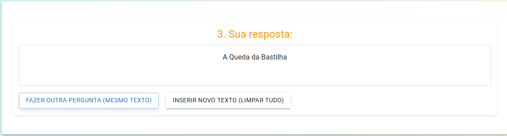

# Aplicação Web Moderna com IA: Resposta a Perguntas em Linguagem Natural

## Introdução e Objetivos

Esta aplicação web robustece a experiência de aprendizado interativo, permitindo que usuários obtenham respostas precisas para perguntas baseadas em um texto fornecido. O sistema foi re arquitetado para utilizar uma interface moderna com **React e Material-UI** no frontend, e uma **Inteligência Artificial mais poderosa no backend com Python, FastAPI e Hugging Face Transformers**. O objetivo é oferecer uma ferramenta dinâmica, responsiva e eficiente para processamento de linguagem natural, facilitando o estudo e a compreensão de textos.

---

## Descrição Técnica da Implementação

### Estrutura da Aplicação

A aplicação é dividida em duas partes principais que se comunicam via API RESTful: Frontend (Cliente) e Backend (Servidor API).

#### 1. Frontend (React)

O frontend é uma Single Page Application (SPA) construída com React e Material-UI. A lógica da interface do usuário e a orquestração dos componentes são gerenciadas principalmente no `src/App.js`.

* **Estrutura de Componentes:**
    * O componente principal `App.js` atua como orquestrador, gerenciando o estado global da aplicação cliente e o fluxo de interação.
    * A interface foi modularizada em componentes menores e mais especializados, localizados na pasta `src/components/`. Alguns exemplos incluem:
        * `Header.js`: Exibe o título principal da aplicação.
        * `HelpModal.js`: Gerencia o conteúdo e a exibição do modal de ajuda.
        * `PassageInput.js`: Responsável pela interface de entrada do texto de contexto.
        * `SavedContext.js`: Exibe o texto de contexto que foi salvo.
        * `QuestionInput.js`: Responsável pela interface de entrada da pergunta.
        * `AnswerDisplay.js`: Exibe a resposta da IA e as opções de continuação.
        * `AboutSection.js`, `Footer.js`: Componentes para seções de conteúdo estático.
    * Utiliza extensivamente componentes pré-construídos do Material-UI (`Container`, `Box`, `Paper`, `Typography`, `TextField`, `Button`, `Modal`) para criar uma interface moderna, responsiva e estilizada, reduzindo a necessidade de CSS customizado extenso.

* **Gerenciamento de Estado (`useState`):**
    * Os estados principais da aplicação (como `textInput`, `passage`, `question`, `answer`, `showHelpModal` e `currentStep` para o fluxo de múltiplos passos) são gerenciados pelo hook `useState` no componente `App.js`.
    * Esses estados e as funções para atualizá-los são passados como *props* para os componentes filhos relevantes. Atualizações nesses estados disparam re-renderizações no React, refletindo as mudanças na UI.

* **Separação de Responsabilidades e Reutilização:**
    * O `App.js` concentra-se na lógica de estado e fluxo geral, além da comunicação com a API.
    * Cada componente na pasta `src/components/` encapsula uma porção específica da UI e sua lógica de apresentação, promovendo:
        * **Legibilidade:** Código mais fácil de entender e navegar.
        * **Manutenção:** Alterações em uma parte específica da UI afetam primariamente seu componente dedicado.
        * **Reutilização:** Os componentes do Material-UI são inerentemente reutilizáveis. Os componentes customizados criados também podem ser reutilizados se necessário em outras partes (embora neste projeto cada um tenha um papel bem definido no fluxo principal).
    * A lógica de chamada à API (`fetch` na função `answering`) reside atualmente no `App.js`. Em projetos maiores, poderia ser abstraída para um módulo de serviço dedicado para maior separação e testabilidade.

#### 2. Backend (API FastAPI - `main.py`)

O backend é uma API RESTful construída com FastAPI em Python, responsável por receber dados do frontend, processá-los com um modelo de Machine Learning e retornar os resultados.

* **Estrutura da API e Endpoints:**
    * Utiliza **FastAPI** pela sua performance, facilidade com tipagem Python e documentação automática.
    * Endpoints definidos:
        * `GET /`: Health check básico da API.
        * `POST /answer-question/`: Endpoint principal que recebe o contexto (`passage`) e a pergunta (`question`), processa via IA e retorna a resposta.
* **Uso de Métodos HTTP:**
    * `GET` é usado para operações idempotentes de recuperação de informação (health check).
    * `POST` é usado para enviar dados ao servidor para processamento (Q&A).
* **Modelos Pydantic:**
    * `QARequest` e `QAResponse` definem os esquemas para validação automática de requisições e serialização de respostas, garantindo a integridade dos dados e auxiliando na documentação da API.
* **Tratamento de Erros:**
    * Implementa múltiplas camadas: validação automática de entrada pelo Pydantic, checagens explícitas para dados de entrada vazios, tratamento para falha no carregamento do modelo de IA (retornando HTTP 503), e tratamento de exceções durante o processamento da IA (retornando HTTP 500). Casos onde o modelo não encontra uma resposta ou tem baixa confiança são tratados retornando uma mensagem específica.
* **Separação entre Lógica de Negócio e Roteamento:**
    * O **Roteamento** é definido pelos decoradores do FastAPI (`@app.post`, `@app.get`).
    * A **Lógica de Negócio** (processamento da Q&A) está contida na função do endpoint `answer_question`, incluindo validações, chamada ao `qna_pipeline` da Hugging Face, e formatação da resposta.
    * O carregamento do modelo de IA é feito uma vez na inicialização da aplicação, separado da lógica de cada requisição para melhor performance.
    * A configuração do CORS é gerenciada como um middleware, separada da lógica dos endpoints.

#### 3. Comunicação

* O frontend envia o texto de contexto e a pergunta do usuário para o backend via uma requisição HTTP POST.
* O backend processa a requisição usando o modelo de IA e retorna a resposta em formato JSON.

### Funcionalidades

-   Interface de usuário moderna, intuitiva e responsiva construída com React e Material-UI, organizada em componentes reutilizáveis.
-   Fluxo de interação guiado em múltiplos passos:
    1.  Inserção do texto de contexto pelo usuário (componente `PassageInput.js`).
    2.  Exibição do contexto salvo (componente `SavedContext.js`) e inserção da pergunta (componente `QuestionInput.js`).
    3.  Apresentação da resposta fornecida pela IA (componente `AnswerDisplay.js`) (sem a pontuação de confiança visível ao usuário final).
    4.  Opções para "Fazer outra pergunta (mesmo texto)" ou "Inserir Novo Texto (Limpar Tudo)".
-   Utilização de um modelo avançado de Question Answering (Hugging Face Transformers) no backend.
-   Extração automática de respostas diretamente do conteúdo inserido pelo usuário, processada no servidor.
-   Modal de ajuda (componente `HelpModal.js`) com um exemplo prático para facilitar o primeiro uso.
-   Estilo visual profissional e consistente provido pelo Material-UI, com responsividade para diferentes tamanhos de tela.

---

## Tecnologias Utilizadas

### Frontend:
-   **React**: Biblioteca JavaScript para construção de interfaces de usuário dinâmicas e componentizadas.
    * Componentes Funcionais e Hooks (`useState`).
-   **Material-UI (MUI)**: Biblioteca de componentes React para um design moderno, responsivo e de fácil implementação, seguindo o Material Design.
-   **JavaScript (ES6+)**: Linguagem de programação principal do frontend.
-   **HTML5 & CSS3**: Estrutura e estilização base (gerenciados pelo React e MUI, com CSS customizado mínimo em `App.css` e `index.css` para estilos globais como fontes e background).

### Backend e Inteligência Artificial:
-   **Python**: Linguagem de programação principal do backend.
-   **FastAPI**: Framework web moderno e de alta performance para construir APIs com Python, com validação de dados usando Pydantic.
-   **Uvicorn**: Servidor ASGI para FastAPI.
-   **Hugging Face `transformers`**: Biblioteca central para tarefas de NLP.
    * **Modelo de IA Escolhido:** O sistema utiliza o modelo **`deepset/roberta-base-squad2`** da Hugging Face. Este é um modelo robusto, pré-treinado em tarefas de Question Answering, capaz de identificar respostas em um texto de contexto ou indicar quando uma resposta não pode ser encontrada. A pontuação de confiança do modelo é usada internamente no backend para filtrar respostas de baixa qualidade, mas não é exibida ao usuário final.
-   **PyTorch**: Utilizado como backend para o modelo da Hugging Face `transformers`.

### Comunicação:
-   **API RESTful**: Padrão de arquitetura para a comunicação entre frontend e backend.
-   **JSON**: Formato de troca de dados.

---

## Instruções de Execução Local

Para executar este projeto localmente, você precisará rodar o backend (FastAPI) e o frontend (React) separadamente, em terminais diferentes.

### 1. Backend (API com FastAPI)

   a. **Navegue até a pasta do backend** (onde está seu arquivo `main.py`).

   b. **Crie e ative o ambiente virtual Python (se ainda não existir):**
      ```bash
      python -m venv venv-qna 
      # No Windows
      venv-qna\Scripts\activate
      # No macOS/Linux
      # source venv-qna/bin/activate
      ```

   c. **Instale as dependências (com o ambiente virtual ativo):**
      ```bash
      pip install fastapi uvicorn "transformers[torch]" torch
      ```

   d. **Inicie o servidor FastAPI:**
      ```bash
      uvicorn main:app --reload
      ```
      Por padrão, o servidor FastAPI estará rodando em `http://localhost:8000`.

### 2. Frontend (Aplicação React)

   a. **Navegue até a pasta do frontend** (onde está seu `package.json` e a pasta `src`).

   b. **Instale as dependências do Node.js (se ainda não o fez):**
      ```bash
      npm install
      ```
      Isso instalará todas as dependências listadas no `package.json`, incluindo React e Material-UI.

   c. **Inicie a aplicação React:**
      ```bash
      npm start
      ```
      Por padrão, a aplicação React estará rodando em `http://localhost:3000` e abrirá automaticamente no seu navegador.

**Importante:** Ambos os servidores (backend e frontend) precisam estar rodando simultaneamente para que a aplicação funcione completamente.

---

## Instruções para Usar o Site (Print Screens da Aplicação Funcionando)

A aplicação guia o usuário através de um processo de três passos principais:

1.  **Passo 1: Escrever o Texto de Contexto**
    * A tela inicial apresentará a seção "1. Escreva seu texto aqui:".
    * Digite ou cole o texto que servirá de base para as perguntas no campo fornecido.
    * Clique no botão "Salvar Texto".
    * 

2.  **Passo 2: Escrever a Pergunta**
    * Após salvar o texto, o "Contexto Salvo" será exibido para referência.
    * Abaixo, a seção "2. Escreva sua Pergunta:" aparecerá.
    * Digite sua pergunta relacionada ao contexto no campo fornecido.
    * Clique no botão "Perguntar".
    * 

3.  **Passo 3: Visualizar a Resposta**
    * Após clicar em "Perguntar", a aplicação mostrará "Analisando sua pergunta com a API...".
    * Em seguida, a seção "3. Sua resposta:" exibirá a resposta encontrada pela IA.
    * Abaixo da resposta, você terá botões para:
        * "Fazer outra pergunta (mesmo texto)": Retorna ao Passo 2.
        * "Inserir Novo Texto (Limpar Tudo)": Retorna ao Passo 1.
    * 

**Funcionalidades Adicionais:**

* **Ajuda/Exemplo de Uso:** Um botão no topo da página ("Examplo de Uso") abre um modal com um exemplo prático.
    * 
* **Começar Novamente (Limpar Tudo):** Botão no topo que permite reiniciar o processo.
    * 

---

## Link para Vídeo Explicativo

-   **Vídeo Demonstrativo (até 30 segundos):** [Video.mp4](https://youtu.be/8sgoZhAJkr8) (substitua pelo link real do seu vídeo)

---

## Referências Bibliográficas e Links de Apoio

-   **React (Documentação Oficial):** [https://reactjs.org/docs/getting-started.html](https://reactjs.org/docs/getting-started.html)
-   **Material-UI (MUI - Documentação):** [https://mui.com/getting-started/installation/](https://mui.com/getting-started/installation/)
-   **FastAPI (Documentação Oficial):** [https://fastapi.tiangolo.com/](https://fastapi.tiangolo.com/)
-   **Hugging Face Transformers (Documentação):** [https://huggingface.co/docs/transformers/index](https://huggingface.co/docs/transformers/index)
-   **Modelo `deepset/roberta-base-squad2` (Hugging Face Hub):** [https://huggingface.co/deepset/roberta-base-squad2](https://huggingface.co/deepset/roberta-base-squad2)
-   **Python (Documentação Oficial):** [https://docs.python.org/3/](https://docs.python.org/3/)
-   **MDN Web Docs (HTML, CSS, JavaScript):** [https://developer.mozilla.org/pt-BR/docs/Web](https://developer.mozilla.org/pt-BR/docs/Web)
-   **Uvicorn (Servidor ASGI):** [https://www.uvicorn.org/](https://www.uvicorn.org/)

---

## Autor

-   **Nome:** Deivid da Silva Galvão
-   **E-mail:** deivid.2002@alunos.utfpr.edu.br

**Disciplina:** Desenvolvimento de Aplicações Web
**Professor:** Luiz Rodrigues

---